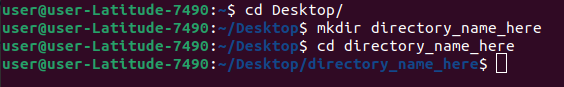
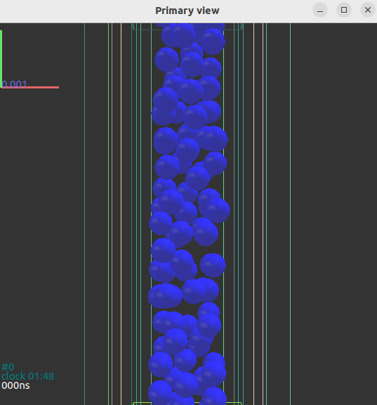

# Modeling
Numerical modeling of the beam particle damper.

# Instructions for running particle damper YADE simulation
SET UP IN TERMINAL:

Make sure a directory is created on your desktop to store .py files and the spreadsheet.

</a>  

Make sure the folloing files are in your new folder: common_functions.py, yade_sdoftrial9.py, spec_vel.csv
spec_vel.csv is the spreadsheet with data for all trials of the simulation.
Now you can run the simulation. Enter this command in your terminal:

yade -j 4 yade_sdoftrial9.py spec_vel.csv 3615

(replace 3615 with the trial in the spreadsheet that you want to run)

A figure, the controls of the simulation, and the primary view of the simulation should appear. Remember to delete the output .txt file under the specific trial in your directory folder if you want to run it again.

  </a>
  

  
***YADE may prefer .txt files over .py files. If an error is displayed because a file is misplaced, attempt to rename it. 

