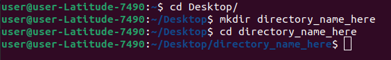

# Modeling
Numerical modeling of the beam particle damper.

# Instructions for running particle damper YADE simulation
SET UP IN TERMINAL:
Make sure a directory is created on your desktop to store .py files and the spreadsheet.

</a>  

